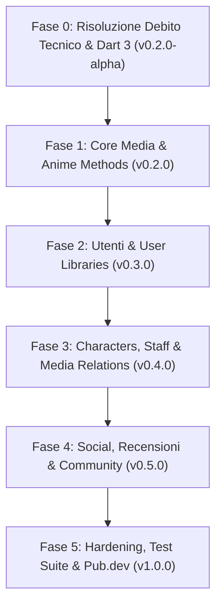

# Kitsumon — Roadmap di Sviluppo (Kitsu.io / kitsu.app API)

Documento di pianificazione e roadmap per l'evoluzione del package **Kitsumon**, wrapper Dart idiomatico e type-safe per le API REST (JSON:API v1) di [kitsu.io](https://kitsu.io) / [kitsu.app](https://kitsu.app).

---

## 🎯 Obiettivi del Progetto

1. **Compatibilità moderna**: Pieno supporto a Dart 3.x (sound null safety) e integrazione con Dio 5.x.
2. **Copertura API completa**: Supporto esaustivo a tutti gli endpoint JSON:API di Kitsu (Media, Utenti, Librerie, Social, Personaggi).
3. **Type Safety & JSON:API compliance**: Parsing strutturato di attributi, relazioni e risorse incluse (`include`), con serializzazione tramite `json_serializable`.
4. **Developer Experience di alto livello**: Interfaccia fluida per filtri, paginazione, ordinamento e sparse fieldset; documentazione completa ed esempi eseguibili.
5. **Pronto per la produzione**: Test unitari con mock fixture, gestione trasparente del rate limiting e pubblicazione ufficiale su `pub.dev`.

---

## 🗺️ Fasi di Sviluppo

---

### 📌 Fase 0: Risoluzione Debito Tecnico & Modernizzazione (v0.2.0-alpha)
*Obiettivo: Ripristinare la compilazione pulita con 0 errori e 0 warning con `dart analyze` su Dart 3.*

- [x] **Migrazione a Sound Null Safety (Dart 3)**:
  - Aggiornare tutti i parametri di costruttori e metodi: rimuovere `@required` dal vecchio `package:meta` a favore della keyword nativa `required`.
  - Definire correttamente i tipi nullable (`?`) e i valori di default in tutti gli helper (`Filter`, `Pagination`, `Sorting`, `Includes`, `SparseFieldSets`, `Request`).
  - Aggiornare i parser in `KitsuValueNormalizer` per gestire valori null in modo sicuro.
- [x] **Migrazione a Dio 5.x**:
  - Aggiornare l'adapter in `KitsuClient`: passare da `package:dio/adapter.dart` a `package:dio/io.dart` (`IOHttpClientAdapter`).
  - Sostituire `DioError` con `DioException` e aggiornare i tipi (`DioExceptionType.connectionTimeout`, `badResponse`, ecc.).
  - Aggiornare gli interceptor al pattern con handler (`RequestInterceptorHandler`, `ResponseInterceptorHandler`, `ErrorInterceptorHandler`).
- [x] **Build & Code Generation**:
  - Verificare la corretta rigenerazione di `lib/src/kitsu.g.dart` tramite `dart run build_runner build`.
  - Eliminare i linter warning residui da `analysis_options.yaml`.

---

### 📌 Fase 1: Core Media & Anime Methods (v0.2.0)
*Obiettivo: Rendere funzionante la consultazione dei contenuti multimediali principali (Anime & Manga).*

- [x] **Implementazione AnimeMethods (`/edge/anime`)**:
  - [x] Implementare `fetchCollection` con supporto a filtri specifici (titolo, stagione, anno, subtype, status, age rating, generi, categorie, slug, id, customFilters).
  - [x] Implementare `fetchResource` per ottenere un singolo anime tramite ID.
  - [x] Implementare `fetchBySlug` per recuperare un anime tramite slug.
  - [x] Collegare e allineare i modelli (`Anime`, `AnimeAttributes` inclusi description, coverImageTopOffset, totalLength, ratingFrequencies, `AnimeTitle`, immagini, frequenze rating).
- [x] **Esposizione modulo Media in `Kitsumon`**:
  - [x] Creare la classe aggregatrice `Media` (`kitsumon.media.anime`).
- [x] **Trending Media (Anime)**:
  - [x] Implementare endpoint `/edge/trending/anime`.
- [ ] **Trending Media (Manga)**:
  - [ ] Implementare endpoint `/edge/trending/manga`.
- [ ] **Implementazione MangaMethods (`/edge/manga`)**:
  - Definire modelli: `Manga`, `MangaAttributes`, generi e formati.
  - Implementare `fetchCollection` e `fetchResource` per i manga.
- [ ] **Categorie & Generi (`/edge/categories`, `/edge/genres`)**:
  - Metodi per esplorare l'albero delle categorie e i tag tematici.

---

### 📌 Fase 2: Gestione Utenti & User Libraries (v0.3.0)
*Obiettivo: Permettere il tracciamento della libreria utente (stato anime/manga, voti, progresso).*

- [ ] **Autenticazione & Token Refresh**:
  - Supporto al refresh automatico del token OAuth2 scaduto (`grant_type=refresh_token`) all'interno dell'interceptor di `KitsuClient`.
- [ ] **Profilo Utente (`/edge/users`)**:
  - Modelli: `User`, `UserAttributes`, avatar, cover, statistiche.
  - Metodi: `fetchResource` (per ID o username), `fetchCurrentUser`.
- [ ] **Librerie Utente (`/edge/library-entries`)**:
  - Modelli: `LibraryEntry`, `LibraryEntryAttributes` (status: `current`, `planned`, `completed`, `on_hold`, `dropped`; progresso episodi/capitoli; rating).
  - Operazioni:
    - `fetchCollection`: recuperare la libreria filtrando per utente, status o tipo media.
    - `createResource`: aggiungere un anime/manga alla libreria.
    - `updateResource`: aggiornare progresso, voto o stato.
    - `deleteResource`: rimuovere un titolo dalla libreria.
- [ ] **Library Events & Logs (`/edge/library-events`)**:
  - Cronologia delle modifiche ed eventi di tracciamento.

---

### 📌 Fase 3: Characters, Staff & Media Relations (v0.4.0)
*Obiettivo: Arricchire le schede dei media con personaggi, doppiatori, episodi e collegamenti esterni.*

- [ ] **Characters & People Generici (`/edge/characters`, `/edge/people`)**:
  - Modelli e metodi di consultazione per personaggi e persone (doppiatori, registi, autori).
- [ ] **Completamento Castings & Staff**:
  - Implementare i metodi di `Castings`, `AnimeStaff` e `MangaStaff`.
- [ ] **Episodi & Capitoli (`/edge/episodes`, `/edge/chapters`)**:
  - Modelli e fetch per lista episodi di un anime e capitoli di un manga.
- [ ] **Streaming Links & Mapping esterni (`/edge/streaming-links`, `/edge/mappings`)**:
  - Recupero link streaming legali (Crunchyroll, Netflix, ecc.).
  - Mappatura ID su database esterni (MyAnimeList, AniList, TheTVDB).

---

### 📌 Fase 4: Social, Recensioni & Community (v0.5.0)
*Obiettivo: Interagire con le funzionalità social della piattaforma Kitsu.*

- [ ] **Recensioni & Reazioni (`/edge/reviews`, `/edge/media-reactions`)**:
  - Lettura e creazione recensioni dettagliate e brevi reazioni.
  - Like alle recensioni e voti alle reazioni.
- [ ] **Feed Social (`/edge/posts`, `/edge/comments`)**:
  - Lettura post dei feed, commenti e relative interazioni (post likes, comment likes).
- [ ] **Relazioni tra utenti (`/edge/follows`, `/edge/blocks`)**:
  - Seguire/smettere di seguire utenti, blocco utenti.
- [ ] **Gruppi (`/edge/groups`, `/edge/group-members`)**:
  - Consultazione gruppi e membri della community.

---

### 📌 Fase 5: Hardening, Test Suite & Pubblicazione Pub.dev (v1.0.0)
*Obiettivo: Standard qualitativi elevati e rilascio stabile della versione 1.0.*

- [ ] **Test Suite Unitari e di Integrazione**:
  - Mock test con risposte JSON reali per verificare la deserializzazione di ogni modello.
  - Test per costruttori di query (`Request`, filtri, paginazione, inclusioni).
  - Test per gestione errori HTTP e API (`ApiException`).
- [ ] **Documentazione & Esempi**:
  - Documentazione per tutte le classi e metodi pubblici (`dartdoc`).
  - Esempi pratici funzionanti nella cartella `example/` (autenticazione, ricerca anime, gestione libreria).
  - Aggiornamento di `README.md` e `CHANGELOG.md`.
- [ ] **Pubblicazione**:
  - Verifica punteggio pana (`pub.dev` score analyzer).
  - Rilascio v1.0.0 su pub.dev.

---

## 📊 Matrice di Priorità

| Priorità | Modulo / Attività | Stato Attuale | Target Version |
| :---: | :--- | :--- | :---: |
| 🔴 **Critica** | Migrazione Dart 3, Null Safety & Dio 5 | ✅ Completato (0 errori, 0 warning) | `v0.2.0-alpha` |
| 🔴 **Critica** | Metodi Anime (`AnimeMethods`) & aggregatore `Media` | ✅ Completato & Testato | `v0.2.0` |
| 🟠 **Alta** | Metodi Manga & Categorie/Generi | Modelli e metodi mancanti | `v0.2.0` |
| 🟠 **Alta** | User Profiles & Library Entries (CRUD tracciamento) | File vuoti | `v0.3.0` |
| 🟡 **Media** | Episodes, Chapters, Castings, External Mappings | File vuoti / stub | `v0.4.0` |
| 🟢 **Bassa** | Posts, Comments, Reviews, Groups | File vuoti | `v0.5.0` |
| ⚪ **Finale** | Mock Test Suite, Esempi completi, Release pub.dev | Test vuoti | `v1.0.0` |
